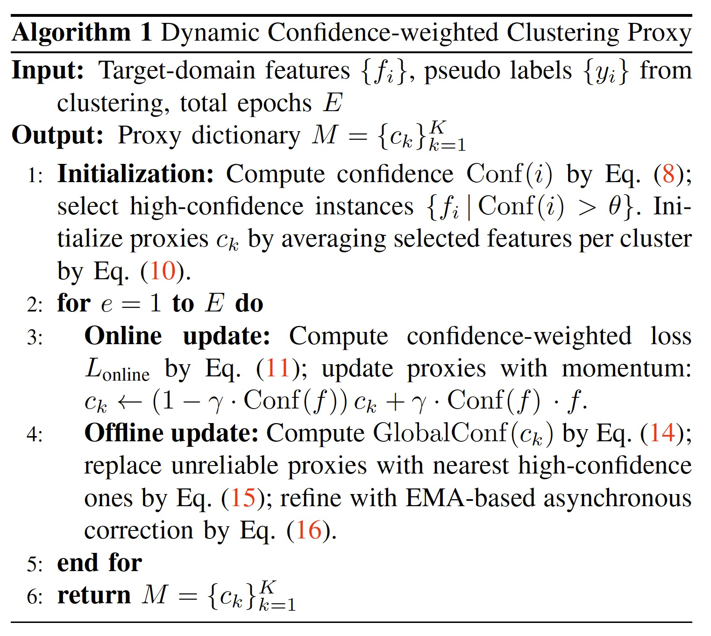

## ↳ Stargazers
[](https://github.com/zqx951102/RPPS/stargazers)

## ↳ Forkers
[](https://github.com/zqx951102/RPPS/network/members)


[](https://opensource.org/licenses/MIT)

<div align="center">

</div>

## Introduction

This is the official implementation for our paper. The code is based on the official code of [DAPS](https://github.com/caposerenity/DAPS) and [SPCL](https://github.com/yxgeee/SpCL).


Challenges and Motivation:
<div align="center">

</div>


The network structure:

<div align="center">

</div>


****
## :fire: NEWS :fire:


- [2025.9.27] **📣We submitted our paper to TIP!**
  
- [2025.9.27] **📣We released the code.**


## Installation

run `python setup.py develop` to enable SPCL

Install Nvidia [Apex](https://github.com/NVIDIA/apex)

Run `pip install -r requirements.txt` in the root directory of the project.


## Quick Start

Let's say `$ROOT` is the root directory.

1. Download [CUHK-SYSU](https://drive.google.com/open?id=1z3LsFrJTUeEX3-XjSEJMOBrslxD2T5af) and [PRW](https://drive.google.com/file/d/1Pz81MP8ePlNZMLm_P-AIkUERyOAXWOTV/view?usp=sharing) datasets, and unzip them to `$ROOT/data`

```
data
├── CUHK-SYSU
├── PRW
```

2. Following the link in the above table, download our pretrained model to anywhere you like, e.g., `$ROOT/ckpt`

Performance profile:
<div align="center">
  

|  Source   |  Target   | Name |                             CKPT                             |
| :-------: | :-------: | -------------| :----------------------------------------------------------: |
|    PRW    | CUHK-SYSU | prw_da.pth | [ckpt](https://drive.google.com/file/d/1JjZKcbcqDeirjhGjvhJ-TIoN0ciUt1AD/view?usp=sharing) |
| CUHK-SYSU |    PRW    | cuhk_da.pth  | [ckpt](https://drive.google.com/file/d/1hhx3LWthEikiN4swn2q_-Gg_58v-91Gu/view?usp=sharing) |


</div>
Please see the Demo photo:
<div align="center">

</div>


## Test
```
PRW as the target domain:
CUDA_VISIBLE_DEVICES=0 python train.py --cfg configs/cuhk_sysu_da.yaml --eval --ckpt ./ckpt/cuhk_da.pth

CUHK-SYSU as the target domain:
CUDA_VISIBLE_DEVICES=0 python train.py --cfg configs/prw_da.yaml --eval --ckpt ./ckpt/prw_da.pth
```

## Training
```
PRW as the target domain:
CUDA_VISIBLE_DEVICES=0 python train.py --cfg configs/cuhk_sysu_da.yaml


CUHK-SYSU as the target domain:
CUDA_VISIBLE_DEVICES=0 python train.py --cfg configs/prw_da.yaml

if out of memory, modify this：
./configs/cuhk_sysu_da.yaml   BATCH_SIZE: 2  #4
./configs/prw_da.yaml   BATCH_SIZE_TRAIN: 2 #4

Before running, you need to modify the addresses in these two files and link them to the directory where your data is located.
OUTPUT_DIR: "/home/zqx_tesla/home/zqx_tesla/PersonReID/PersonReID2/RPPS/Output/cuhk-da"
OUTPUT_DIR: "/home/zqx_tesla/home/zqx_tesla/PersonReID/PersonReID2/RPPS/Output/prw-da"
```
## Algorithm procedure:
<div align="center">

</div>


## Comparison with SOTA:

<div align="center">

</div>
<div align="center">

</div>


## Qualitative Results:
<div align="center">

</div>

<div align="center">

</div>

<div align="center">

</div>

## Acknowledgment
Thanks to the authors of the following repos for their code, which was integral in this project:
- [DAPS](https://github.com/caposerenity/DAPS)
- [DDAM](https://github.com/mustansarfiaz/DDAM-PS)
- [FOUS](https://github.com/whbdmu/FOUS)
- [DSCA](https://github.com/whbdmu/DSCA)
- [SeqNet](https://github.com/serend1p1ty/SeqNet)


## Citation
If you find this code useful for your research, please cite our paper
```
@article{zhang2025dynamic,
  title={Dynamic frequency selection and spatial interaction fusion for robust person search},
  author={Zhang, Qixian and Miao, Duoqian and Zhang, Qi and Zhao, Cairong and Zhang, Hongyun and Sun, Ye and Wang, Ruizhi},
  journal={Information Fusion},
  volume={124},
  pages={103314},
  year={2025},
  publisher={Elsevier}
}
```
```
@article{zhang2024learning,
  title={Learning adaptive shift and task decoupling for discriminative one-step person search},
  author={Zhang, Qixian and Miao, Duoqian and Zhang, Qi and Wang, Changwei and Li, Yanping and Zhang, Hongyun and Zhao, Cairong},
  journal={Knowledge-Based Systems},
  volume={304},
  pages={112483},
  year={2024},
  publisher={Elsevier}
}
```
```
@article{zhang2024attentive,
  title={Attentive multi-granularity perception network for person search},
  author={Zhang, Qixian and Wu, Jun and Miao, Duoqian and Zhao, Cairong and Zhang, Qi},
  journal={Information Sciences},
  volume={681},
  pages={121191},
  year={2024},
  publisher={Elsevier}
}
```
```
@inproceedings{li2021sequential,
  title={Sequential End-to-end Network for Efficient Person Search},
  author={Li, Zhengjia and Miao, Duoqian},
  booktitle={Proceedings of the AAAI Conference on Artificial Intelligence},
  volume={35},
  number={3},
  pages={2011--2019},
  year={2021}
}
```

## Contact
If you have any question, please feel free to contact us. E-mail: [zhangqx@tongji.edu.cn](mailto:zhangqx@tongji.edu.cn) 
